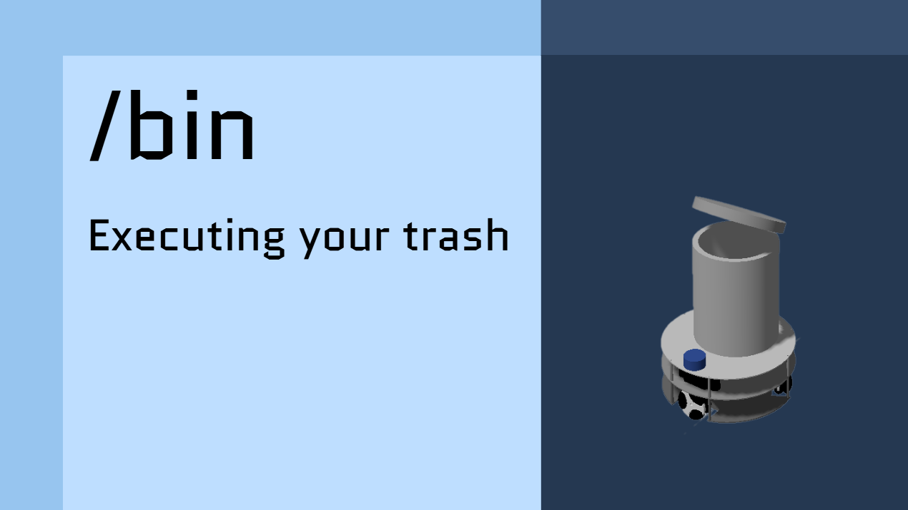
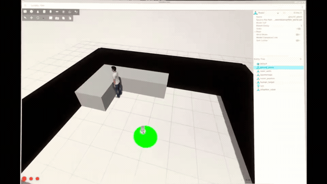

# SlashBin

<p align="center">
  
</p>

<p align="center">
  <strong>A voice-activated autonomous smart bin built with ROS 2.</strong><br />
  It finds a caller, navigates to them, and returns home on command.
</p>

<p align="center">
  
  
  
  
  
</p>

## What it does

SlashBin is a simulated omni-wheel robot that responds to two voice commands:

| Voice command | Behavior |
| --- | --- |
| `robot come here` | Spins to search, detects a person with its camera, navigates to a comfortable stand-off distance, and waits nearby. |
| `robot go home` | Cancels its current objective and autonomously returns to its saved home pose. |

The project combines voice recognition, computer vision, motion control, and autonomous navigation into one ROS 2 package.

## Demo videos

<p align="center">
  <a href="https://oscar-eriksen.vercel.app/projectDocs/SlashBin/slashbin_final_demo.mp4">
    
  </a>
</p>

<p align="center"><em>Click the preview to watch the full final demo.</em></p>

[▶ Watch the full demo](https://oscar-eriksen.vercel.app/projectDocs/SlashBin/slashbin_final_demo.mp4)

## System overview

```text
Voice command
    │
    ▼
Vosk speech recognition ───► Robot state machine ───► Nav2 goal management
                                      │                         │
                                      ▼                         ▼
                          YOLO person detection        Gazebo simulation
                                      │                         │
                                      └──── RGB-D camera ───────┘
```

### Key components

- **Voice interface** — a Vosk-based ROS 2 node listens for the wake and dismiss commands.
- **Person detection** — a YOLO model processes synchronized RGB and depth images, confirms detections across multiple frames, and estimates the person's location.
- **Autonomous navigation** — Nav2 plans to the detected person or to the configured home pose using the included map and navigation parameters.
- **Omni-wheel control** — a C++ kinematics node converts velocity commands into wheel velocities, publishes odometry, and broadcasts the transform needed by navigation.
- **Simulation environment** — Gazebo launches the robot model, sensors, controllers, world, and ROS–Gazebo bridges.

## Dependencies

The project uses ROS 2, Gazebo, Nav2, `ros_gz_*`, `ros2_control`, Python, and C++. The voice and vision nodes also use Vosk, `sounddevice`, OpenCV/CvBridge, PyTorch, and Ultralytics YOLO.

## Repository layout

```text
src/smartbin_robot/
├── config/       # Navigation, controller, bridge, and home-pose settings
├── launch/       # Simulation and navigation launch files
├── map/          # Saved map used by Nav2
├── meshes/       # Robot and bin visual assets
├── scripts/      # Voice-trigger and person-detection nodes
├── src/          # Omni-wheel kinematics and odometry node
├── urdf/          # Robot, sensor, and controller descriptions
└── worlds/        # Gazebo world
media/             # Project demonstration videos
```
